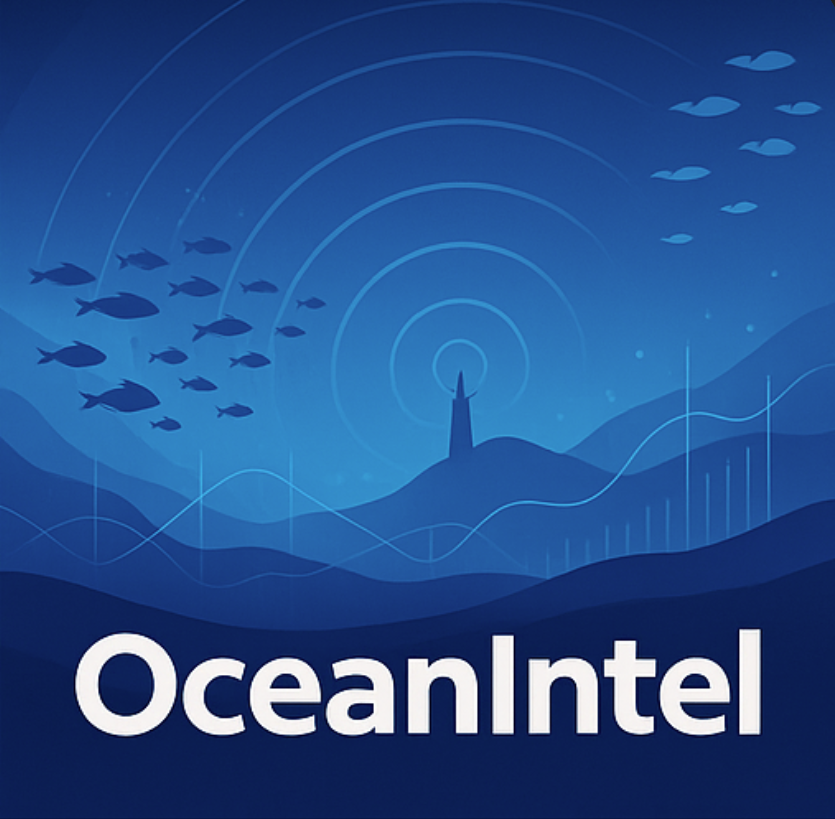
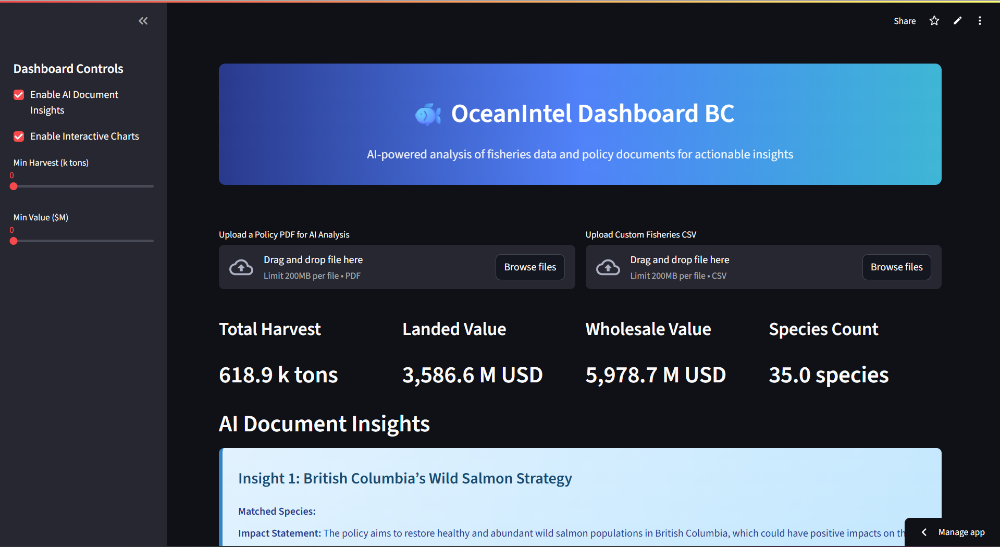
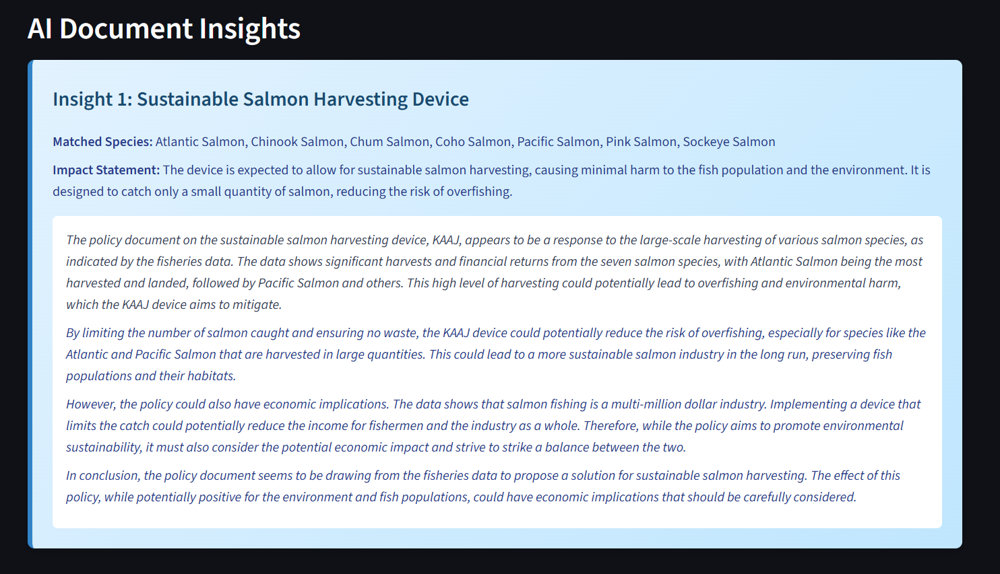
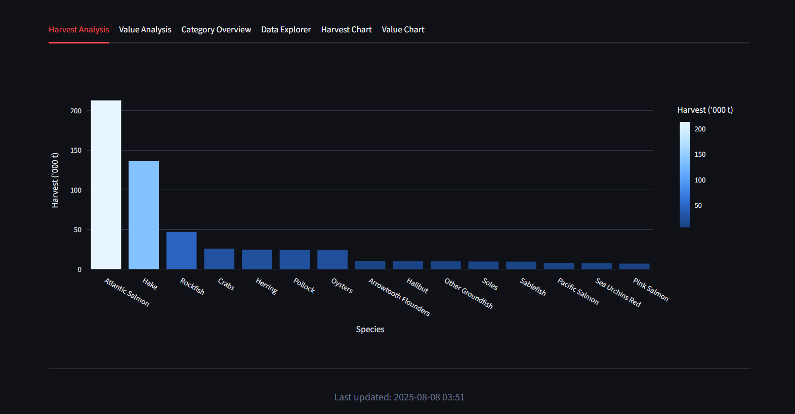
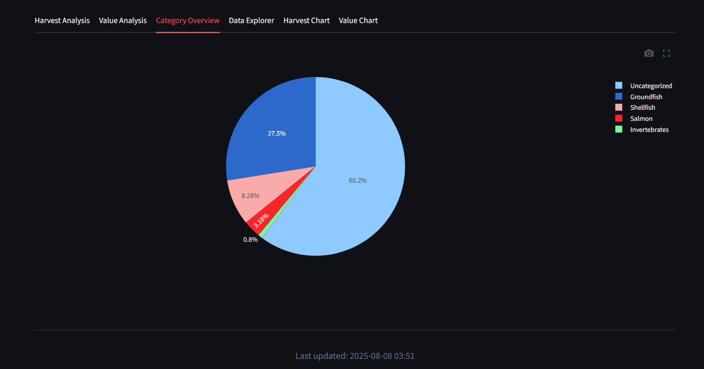

<div align="left">
  <div style="display: inline-block;">
    <h1 style="display: inline-block; vertical-align: middle; margin-top: 0;">
      OceanIntel Dashboard
    </h1>
    
    <p><em>AI-powered fisheries data analysis & policy insight platform</em></p>
    <p>
      
      
      
      
    </p>
    <p style="margin:4px 0; white-space: nowrap;">
  Built with:&nbsp;
  <br>

<p align="center">
  
</p>

 <table align="center">
    <tr>
      <td align="center">
        <br>
        <b>Deployment and UI</b>
      </td>
      <td align="center">
        <br>
        <b>AI Insights</b>
      </td>
      <td align="center">
        <br>
        <b>Core Language</b>
      </td>
      <td align="center">
        <br>
        <b>Interactive Charts</b>
      </td>
    </tr>
    <tr>
      <td align="center">
        <br>
        <b>Data Manipulation</b>
      </td>
      <td align="center">
        <br>
        <b>Numerical Computing</b>
      </td>
      <td align="center">
        <br>
        <b>Static Visualizations</b>
      </td>
      <td align="center">
        <br>
        <b>Env Config</b>
      </td>
    </tr>
    <tr>
      <td align="center">
        <br>
        <b>PDF Extraction</b>
      </td>
      <td align="center">
        <br>
        <b>CLI</b>
      </td>
      <td></td><td></td>
    </tr>
  </table>

  </div>
</div>

<br clear="left"/>

---

<details><summary>📜 Table of Contents</summary>

- [📖 Overview](#-overview)
- [📸 Screenshots](#-screenshots)
- [✨ Features](#-features)
- [🛠️ Tech Stack](#️-tech-stack)
- [🚀 Quick Start](#-quick-start)
- [📁 Project Structure](#-project-structure)
- [🔧 Configuration](#-configuration)
- [🎮 Usage Examples](#-usage-examples)
- [🔮 Roadmap](#-roadmap)
- [🤝 Contributing](#-contributing)
- [📄 License](#-license)

</details>

---

## 📖 Overview

**OceanIntel** is an interactive Streamlit dashboard that leverages OpenAI's GPT to extract insights from fisheries policy documents and cross-reference them with catch & value data. Dive deep into species trends, policy impacts, and generate data-driven decisions with AI assistance.

### 🌟 Why Choose OceanIntel?

- **🤖 AI-Powered Analysis** — GPT-driven insights from policy documents
- **📊 Interactive Visualizations** — Dynamic charts and graphs for data exploration
- **🔄 Cross-Reference Intelligence** — Match policy mentions with species data
- **📁 Custom Data Support** — Upload and analyze your own fisheries datasets
- **💾 Export Capabilities** — Download filtered data and reports
- **🎨 Responsive Design** — Beautiful gradient interface with tabbed navigation

---

## 📸 Screenshots

<div align="center">
  
  
  
  
</div>

<div align="center">
  <em>📊 Harvest & Value Charts • 🤖 AI Insights</em>
</div>

---

## ✨ Features

<table>
<tr>
<td width="50%">

### 📄 **Document Analysis**

- **PDF Text Extraction** with PyMuPDF for policy documents
- **GPT-Powered Summarization** of complex fisheries policies
- **Keyword Recognition** for species and regulation identification
- **Policy Impact Assessment** with AI-driven insights
- **Document Upload** supporting multiple PDF formats
- **Automated Processing** with real-time analysis

</td>
<td width="50%">

### 📊 **Data Visualization**

- **Interactive Charts** powered by Plotly for exploration
- **Static Visualizations** with Matplotlib for reports
- **Harvest Trend Analysis** with time-series plotting
- **Value Impact Charts** showing economic implications
- **Category Comparisons** across different species
- **Responsive Design** adapting to different screen sizes

</td>
</tr>
<tr>
<td width="50%">

### 🔍 **Intelligence & Insights**

- **Cross-Reference Analysis** linking policies to data
- **Species Impact Tracking** with trend identification
- **Policy Mention Matching** using advanced NLP
- **Data-Driven Decisions** with AI recommendations
- **Historical Comparisons** showing policy effects over time
- **Predictive Analytics** for future trend forecasting

</td>
<td width="50%">

### ⚙️ **Customization & Export**

- **Custom Data Upload** supporting CSV file formats
- **Flexible Configuration** for different datasets
- **Downloadable Reports** in CSV format
- **Filtered Data Export** with custom date ranges
- **Responsive Interface** with gradient styling
- **Tabbed Navigation** for organized data access

</td>
</tr>
</table>

---

## 🛠️ Tech Stack

<div align="center">

| Technology | Purpose | Why We Chose It |
|:----------:|:-------:|:---------------:|
|  | **Dashboard Framework** | Rapid prototyping & interactive web apps |
|  | **Core Language** | Rich data science ecosystem & AI libraries |
|  | **AI Processing** | State-of-the-art GPT models for text analysis |
|  | **Interactive Charts** | Dynamic visualizations with user interaction |
|  | **Data Analysis** | Powerful data manipulation & analysis tools |
|  | **PDF Processing** | Reliable text extraction from policy documents |

</div>

---

## 🚀 Quick Start

Get your fisheries analysis dashboard running in minutes:

### Prerequisites

- **Python 3.8+** (Python 3.9+ recommended)
- **OpenAI API Key** for GPT-powered analysis
- **Streamlit** for dashboard framework

### Installation

```bash
# Clone the repository
git clone https://github.com/AlexanderPotiagalov/OceanIntel.git
cd OceanIntel

# Install dependencies
pip install -r requirements.txt
```

### Environment Setup

Create `.env` in the root directory:

```env
# OpenAI Configuration
OPENAI_API_KEY=your_openai_api_key_here

# Application Configuration
STREAMLIT_SERVER_PORT=8501
STREAMLIT_SERVER_ADDRESS=localhost
```

### Launch the Dashboard

```bash
# Start the Streamlit application
streamlit run app.py
```

🎉 **Success!** Navigate to `http://localhost:8501` to explore your fisheries data!

### Getting Your OpenAI API Key

1. Visit [OpenAI Platform](https://platform.openai.com/api-keys)
2. Create an account or sign in
3. Navigate to API Keys section
4. Generate a new secret key
5. Copy and paste into your `.env` file

---

## 📁 Project Structure

```
OceanIntel/
├── app.py                      # Main Streamlit application
├── requirements.txt            # Python dependencies
├── .env                       # Environment variables
├── assets/                    # Screenshots and images
│   ├── preview.png
│   ├── harvest_chart.png
│   ├── value_chart.png
│   └── insights.png
├── data/                      # Sample datasets
│   ├── sample_fisheries.csv
│   └── policy_documents/
├── src/
│   ├── data_processing.py     # Data manipulation utilities
│   ├── ai_analysis.py         # OpenAI integration
│   ├── visualization.py      # Chart generation
│   └── pdf_parser.py          # Document processing
├── docs/                      # Documentation
└── tests/                     # Unit tests
```

---

## 🔧 Configuration

### Required Dependencies

```txt
streamlit>=1.28.0
openai>=1.0.0
pandas>=2.0.0
numpy>=1.24.0
plotly>=5.15.0
matplotlib>=3.7.0
PyMuPDF>=1.23.0
python-dotenv>=1.0.0
```

### Environment Variables

| Variable | Description | Required |
|----------|-------------|----------|
| `OPENAI_API_KEY` | OpenAI API key for GPT analysis | ✅ |
| `STREAMLIT_SERVER_PORT` | Port for Streamlit server | ❌ |
| `STREAMLIT_SERVER_ADDRESS` | Server address | ❌ |

### Data Format Requirements

Your CSV files should include these columns:
- `species`: Species name or identifier
- `year`: Data collection year
- `harvest`: Harvest quantity
- `value`: Economic value
- `region`: Geographic region (optional)

---

## 🎮 Usage Examples

### Loading Custom Data

```python
import pandas as pd
import streamlit as st

# Upload CSV file
uploaded_file = st.file_uploader("Choose a CSV file", type="csv")

if uploaded_file is not None:
    # Read the data
    df = pd.read_csv(uploaded_file)
    
    # Display basic statistics
    st.write("Dataset Overview:")
    st.dataframe(df.head())
    
    # Generate visualizations
    create_harvest_chart(df)
    create_value_analysis(df)
```

### AI-Powered Policy Analysis

```python
from openai import OpenAI
import fitz  # PyMuPDF

def analyze_policy_document(pdf_path):
    # Extract text from PDF
    doc = fitz.open(pdf_path)
    text = ""
    for page in doc:
        text += page.get_text()
    
    # Analyze with GPT
    client = OpenAI()
    response = client.chat.completions.create(
        model="gpt-4",
        messages=[
            {"role": "system", "content": "You are a fisheries policy analyst."},
            {"role": "user", "content": f"Analyze this policy document: {text}"}
        ]
    )
    
    return response.choices[0].message.content
```

### Creating Interactive Charts

```python
import plotly.express as px
import streamlit as st

def create_harvest_trends(df):
    # Create interactive line chart
    fig = px.line(df, 
                  x='year', 
                  y='harvest',
                  color='species',
                  title='Harvest Trends Over Time')
    
    fig.update_layout(
        xaxis_title="Year",
        yaxis_title="Harvest Quantity",
        hovermode='x unified'
    )
    
    st.plotly_chart(fig, use_container_width=True)
```

---

## 🔮 Roadmap

Exciting features coming to OceanIntel:

- 🌐 **Multi-Language Support** — Policy analysis in multiple languages
- 📱 **Mobile Optimization** — Enhanced mobile dashboard experience
- 🔄 **Real-Time Data Integration** — Live data feeds from fisheries databases
- 📊 **Advanced Analytics** — Machine learning predictions and forecasting
- 🗺️ **Geographic Mapping** — Interactive maps showing regional data
- 📧 **Automated Reports** — Scheduled email reports with insights
- 🔐 **User Authentication** — Multi-user support with role-based access
- 📈 **Performance Monitoring** — Dashboard usage analytics
- 🤝 **API Integration** — Connect with external fisheries management systems
- 🎯 **Custom Alerts** — Notifications for significant policy changes

---

## 🤝 Contributing

We welcome contributions to improve OceanIntel! Here's how you can help:

### Development Setup

```bash
# Fork and clone the repository
git clone https://github.com/yourusername/OceanIntel.git
cd OceanIntel

# Create a virtual environment
python -m venv venv
source venv/bin/activate  # On Windows: venv\Scripts\activate

# Install development dependencies
pip install -r requirements-dev.txt

# Run tests
python -m pytest tests/

# Start the development server
streamlit run app.py
```

### Ways to Contribute

- 🐛 **Bug Reports** — Help us identify and fix issues
- 💡 **Feature Requests** — Suggest new functionalities for fisheries analysis
- 🔧 **Code Contributions** — Submit pull requests with improvements
- 📚 **Documentation** — Improve guides and API documentation
- 📊 **Data Examples** — Contribute sample datasets for testing
- 🎨 **UI/UX Design** — Enhance the dashboard interface
- 🧪 **Testing** — Help test new features and report feedback
- 🌍 **Localization** — Add support for different languages and regions

### Contribution Guidelines

Please ensure your contributions follow our coding standards:
- Use Black for code formatting
- Include docstrings for functions
- Add unit tests for new features
- Update documentation as needed

---

## 📄 License

<div align="center">

**OceanIntel Dashboard** is open source and available under the [MIT License](LICENSE).

Built for marine researchers, policy analysts, and fisheries management professionals.

---

### 👨‍💻 **Created with ❤️ by [Alexander Potiagalov](https://github.com/AlexanderPotiagalov)**

_Empowering sustainable fisheries through data-driven insights._

---

<p>
  
  
  
  
</p>

**⭐ Star this repository if you found it helpful for your fisheries research!**

</div>
